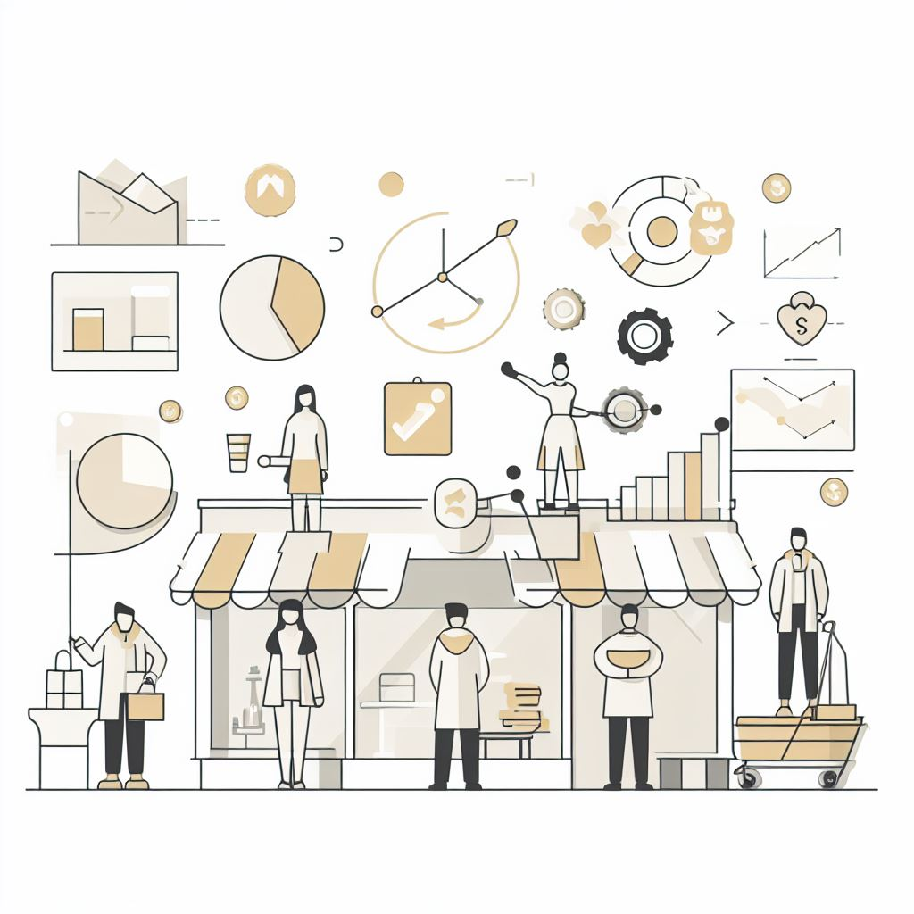

# Customer Behavior Analysis  

## 📌 Project Overview  
This project focuses on analyzing **customer behavior patterns** to identify factors influencing **churn and retention**. By leveraging customer attributes and interaction data, the goal is to deliver actionable insights that help build **data-driven marketing strategies**, improve **engagement**, and enhance **overall customer experience**:contentReference[oaicite:0]{index=0}.

---

## 🎯 Objectives  
- Gain insights into customer purchase and engagement patterns.  
- Identify **churn risks** and factors that influence customer retention.  
- Provide recommendations to **optimize marketing strategies**.  
- Enable businesses to **increase loyalty and satisfaction**:contentReference[oaicite:1]{index=1}.  

---

## 📊 Data & Mission  
- **Data**: Contains customer attributes (demographics, interactions, engagement behavior).  
- **Mission**: Decode customer behavior, empower marketing decisions, and deliver **personalized experiences** that increase retention and lifetime value:contentReference[oaicite:2]{index=2}.  

---

## 🔎 Exploratory Data Analysis (EDA)  
Key findings from the analysis:contentReference[oaicite:3]{index=3}:  
- **90%** of customers prefer **not saving credit card info**, showing strong privacy concerns.  
- Majority of customers engage more on **desktop platforms** than mobile.  
- **Brief website visits** and **preference for immediate purchases** highlight fast decision-making behavior.  
- Location patterns show higher engagement from **Location Codes 415, 510, and 408**.  
- Customers who avoid saving credit card info are also less likely to accept push notifications.  

---

## 💡 Recommendations  
- Streamline **checkout process** for faster transactions.  
- Optimize **desktop shopping experience** while enhancing **mobile usability**.  
- Provide **clearer product information** to encourage informed purchases.  
- Promote the **benefits of saving payment info** with incentives.  
- Personalize **push notifications** to increase opt-ins:contentReference[oaicite:4]{index=4}.  

---

## 📂 Deliverables  
- 📄 [Project Report (PDF)](./deliverables/Customer_Behavior_Analysis.pdf)  
- 📊 [Presentation (PPTX)](./deliverables/Customer_Behavior_Analysis.pptx)  
- 💻 [Interactive Notebook (HTML)](./deliverables/Customer_Behavior_Analysis.html)  
- 🐍 [Jupyter Notebook (IPYNB)](./deliverables/Customer_Behavior_Analysis.ipynb)  

---

## 👥 Stakeholders & Beneficiaries  
- **Marketing Teams** – Improve targeted campaigns and retention programs.  
- **Business Strategy Teams** – Gain customer insights for better planning.  
- **Customers** – Receive personalized experiences and better engagement.  

---

## 🛠 Tools & Technologies  
- **Python (pandas, matplotlib, seaborn)** – Data cleaning & visualization.  
- **Jupyter Notebook** – Interactive analysis.  
- **Tableau / Excel** – Dashboarding & visual reports.  
- **PowerPoint** – Presentation of findings.  

---

## 🚀 Outcomes  
- Identified **high-retention patterns** across specific customer segments.  
- Proposed strategies that can potentially **increase retention rates by 10–15%**.  
- Delivered a structured framework for **data-driven marketing decisions**.  

---
